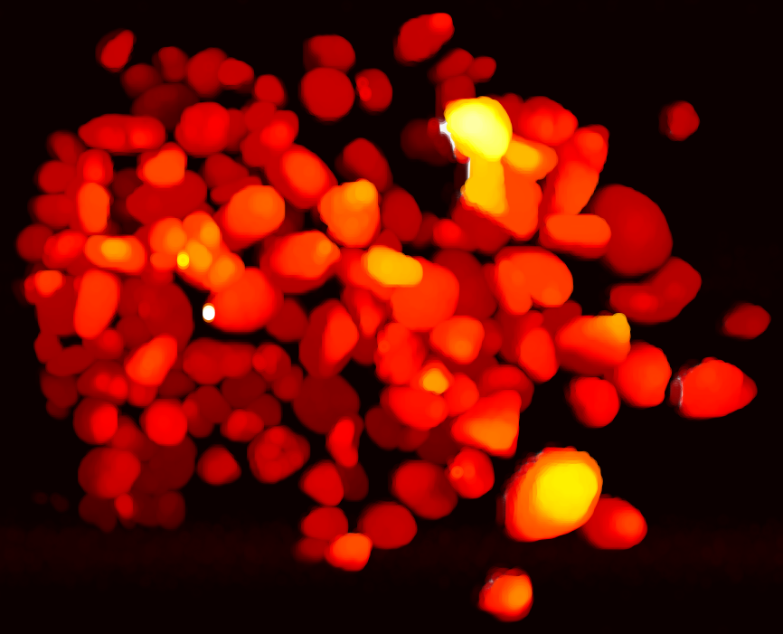

# morphological-image-processing

## Table of contents

- data: pilot data file
- figure: images and plots
- plot: code for visualizing data

## Function / purpose

When drilling for oil or gas, it is common to encounter unstable formations of rock and soil. These unstable formations can cause problems during drilling and result in a "stuck pipe" event--the drill string gets stuck and cannot be removed from the drilling hole. What follows is costly (hundreds of millions of dollars) repair or loss of the well. Therefore, detection of unstable formations in a timely manner is crucial.

During drilling, the size and shape of the rock chips removed from the well can be used to infer whether the drilling condition is abnormal. In our project, we explore the LiDAR data of rock samples and train classification models to predict the size of a rock based on statistics of its 3D map.

## Data preprocessing

The laser detector generates $(X,Y,Z)$ data with a resolution of 1 $mm$. In the pilot data, each row represents a 3D point at the surface of rocks, with Cartesian coordinate $(X,\textbf{Z}, \textbf{Y})$.

We plan to label rock samples by sieving them into several size classes in the lab. Then we pass them through the laser detector. We will extract features from segmented images as independent variables. Some considerations:

- Circumference
- Area
- Long axis length
- Short axis length
- Maximal height
- Average height
- Magnitude of gradient at the maximal height

<!--

## Set up / usage

## Example / showcase

-->

## Contact

- Anqi Zhang: anqizhang@utexas.edu
- Santiago Callerio: scallerio@utexas.edu
- Justin Lerma: justin.lerma01@utexas.edu

## Reference

- Thurley, Matthew J. "Automated online measurement of limestone particle size distributions using 3D range data." Journal of Process Control 21.2 (2011): 254-262.
- Engin, Irfan C., and Norbert H. Maerz. "Size distribution analysis of aggregates using LiDAR scan data and an alternate algorithm." *Measurement* 143 (2019): 136-143.

## License

GNU General Public License v3.0
