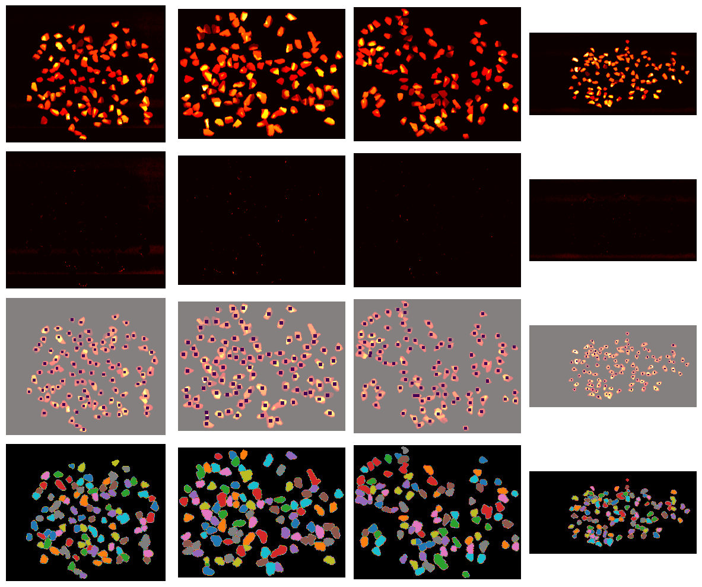

# morphological-image-processing

## Table of contents

- data: LiDAR images of sieved rocks and pre-sieved rocks
- figure: visualization of data, analysis, and illustration of the pipeline
- clean: segment rocks and extract features from each region

## Function / purpose

When drilling for oil or gas, it is common to encounter unstable formations of rock and soil. These unstable formations can cause problems during drilling and result in a "stuck pipe" event--the drill string gets stuck and cannot be removed from the drilling hole. What follows is costly (hundreds of millions of dollars) repair or loss of the well. Therefore, detection of unstable formations in a timely manner is crucial.

During drilling, the size and shape of the rock chips removed from the well can be used to infer whether the drilling condition is abnormal. In our project, we explore the LiDAR data of rock samples and train classification models to predict the size of a rock based on statistics of its 3D map.

## Data preprocessing

The laser detector generates three-dimensional data with a resolution of 1 $mm$. We have transformed it into images with $(X,Y)$-coordinates embedded as pixel location, and $Z$ as the pixel values.

We sieved the rock samples into several size classes in the lab:

- "12": 5/8 inches >= rock size > 1/2 inches
- "58": 3/4 inches >= rock size > 5/8 inches
- "34": rock size > 3/4 inches

We extracted the following features from segmented images with intensity information. For more details, see the official documentation.

- Orientation
- Perimeter
- Area
- Length of the major axis
- Length of the minor axis
- Mean height
- Median height
- Max height
- Standard deviation of height
- Mean gradient
- Standard deviation of gradient
- Gradient at the max height
- First 4 weighted Hu moments

<!--

## Set up / usage

## Example / showcase

-->

## Contact

- Anqi Zhang: anqizhang@utexas.edu
- Santiago Callerio: scallerio@utexas.edu

## License

GNU General Public License v3.0
